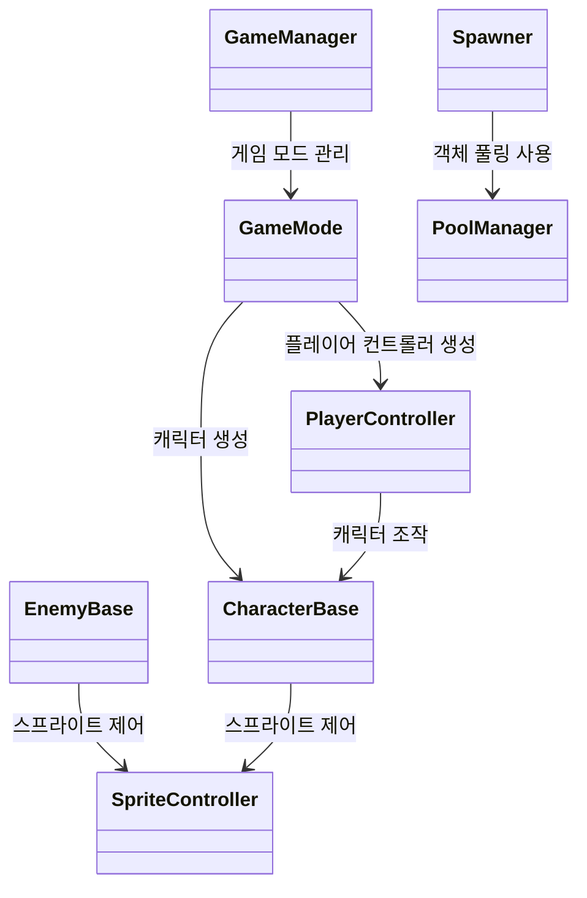

# 🎮 2D 던전 탐험 게임 프로젝트

이 프로젝트는 유니티 엔진을 사용하여 개발된 2D 던전 탐험 게임입니다. 플레이어는 캐릭터를 조작하여 던전을 탐험하고, 적과 전투를 벌이며 게임을 진행합니다. 객체 풀링, Cinemachine 카메라 시스템 등 다양한 기능을 활용하여 효율적이고 동적인 게임 환경을 구현했습니다.

## 📂 프로젝트 구조

```
├── Scripts/                    # 게임 로직 스크립트
│   ├── Managers/              # 게임 관리 스크립트
│   │   ├── GameManager.cs
│   │   ├── GameMode.cs
│   │   ├── PoolManager.cs
│   │   └── ...
│   ├── Characters/           # 캐릭터 관련 스크립트
│   │   ├── CharacterBase.cs
│   │   ├── PlayerController.cs
│   │   ├── EnemyBase.cs
│   │   └── ...
│   ├── Environment/         # 환경 관련 스크립트
│   │   ├── Spawner.cs
│   │   └── ...
│   ├── Utility/              # 유틸리티 스크립트
│   │   ├── Reposition.cs
│   │   ├── SetCameraTarget.cs
│   │   └── ...
│   └── ...
└── ...
```

## 📊 클래스 관계도



## 🕹️ 게임 로직

<details>
<summary>🎮 GameManager</summary>

**역할**: 게임의 전반적인 상태와 로직을 관리하는 싱글톤 매니저입니다.

**주요 기능**:
- 현재 게임 모드 관리
- 다른 시스템에서 게임 모드 접근 제공

**핵심 함수**:
- `GetGameMode()`: 현재 게임 모드 반환
- `SetGameMode()`: 게임 모드 설정

</details>

<details>
<summary>🎮 GameMode</summary>

**역할**: 플레이어 컨트롤러와 캐릭터를 생성하고 연결합니다.

**주요 기능**:
- 플레이어 컨트롤러 및 캐릭터 생성 및 연결

**핵심 함수**:
- `SpawnPlayer()`: 플레이어 컨트롤러와 캐릭터 생성 및 연결

</details>

<details>
<summary>🎮 DungeonGameMode</summary>

**역할**: 던전 게임 모드를 관리하는 클래스입니다. GameMode를 상속받아 던전 특화 기능을 제공합니다.

**주요 기능**:
- 던전 게임 모드 관리 (상세 기능은 추가 구현 필요)

</details>


## 👤 캐릭터

<details>
<summary>🚶 CharacterBase</summary>

**역할**: 캐릭터의 기본 동작을 정의하는 추상 클래스입니다.

**주요 기능**:
- 이동 입력 처리
- 실제 이동 로직 처리

**핵심 함수**:
- `OnMove()`: 이동 입력을 받아 처리하는 가상 메서드
- `HandleMovement()`: 실제 이동 로직 처리

</details>

<details>
<summary>🧍 PlayerController</summary>

**역할**: 이동 입력을 받아 캐릭터에 전달합니다.

**주요 기능**:
- 이동 입력 처리 및 캐릭터에 전달

**핵심 함수**:
- `OnMove()`: 이동 입력을 받아 캐릭터에 전달

</details>

<details>
<summary>👾 EnemyBase</summary>

**역할**: 적의 이동 로직을 처리합니다.

**주요 기능**:
- 적 이동 로직 처리
- 플레이어 타겟 설정 및 추적

**핵심 함수**:
- `Movement()`: 적의 이동 로직 처리
- `FindTarget()`: 플레이어 타겟을 찾아 이동 방향 설정

</details>


## 🏭 오브젝트 관리

<details>
<summary>♻️ PoolManager</summary>

**역할**: 객체 풀링을 관리합니다.

**주요 기능**:
- 비활성화된 오브젝트 반환 또는 새 오브젝트 생성

**핵심 함수**:
- `Get()`: 지정된 인덱스의 비활성화된 오브젝트를 반환하거나 새로 생성

</details>

<details>
<summary>🔥 Spawner</summary>

**역할**: 적을 생성합니다.

**주요 기능**:
- 플레이어를 찾아 스포너의 부모로 설정
- 랜덤한 위치에 적 생성

**핵심 함수**:
- `SetPlayer()`: 플레이어를 찾아 스포너의 부모로 설정
- `Spawn()`: 랜덤한 위치에 적 생성

</details>


## 🔧 유틸리티

<details>
<summary>🔄 Reposition</summary>

**역할**: 트리거 영역을 벗어날 때 오브젝트의 위치를 재조정합니다.

**주요 기능**:
- 트리거 영역 벗어날 시 오브젝트 위치 재조정

**핵심 함수**:
- `OnTriggerExit2D()`: 트리거 영역을 벗어날 때 오브젝트 위치 재조정

</details>

<details>
<summary>🎥 SetCameraTarget</summary>

**역할**: Cinemachine 카메라의 타겟을 설정합니다.

**주요 기능**:
- 플레이어 캐릭터를 카메라 추적 대상으로 설정

</details>


## 🎨 시각적 요소

<details>
<summary>🖼️ SpriteController</summary>

**역할**: 애니메이션과 스프라이트 방향을 업데이트합니다.

**주요 기능**:
- 애니메이션 및 스프라이트 방향 업데이트

**핵심 함수**:
- `LateUpdate()`: 애니메이션과 스프라이트 방향 업데이트

</details>
