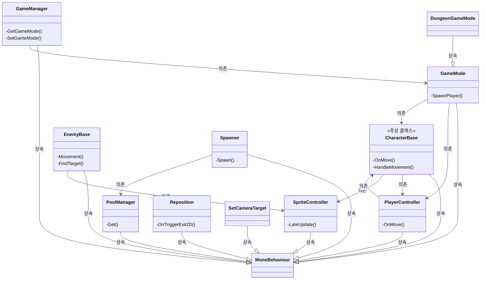

# 🎮 던전 게임 프로젝트

이 프로젝트는 유니티 엔진을 사용하여 개발된 간단한 2D 던전 게임입니다. 플레이어는 캐릭터를 조작하여 던전을 탐험하고, 적들과 전투를 벌입니다. 이 README 파일은 프로젝트의 주요 클래스와 기능에 대한 개요를 제공합니다.

## 🕹️ 게임 플레이

플레이어는 입력을 통해 캐릭터를 조작하고, 적들을 물리치며 던전을 탐험합니다. 카메라는 플레이어 캐릭터를 따라가며, 게임의 진행 상황은 `GameManager`를 통해 관리됩니다.

## 🗂️ 클래스 구조

<b>🎮 캐릭터 & 플레이어</b>

* 🧍 **CharacterBase**: 모든 캐릭터의 기본 클래스입니다. 이동 로직을 포함하며, `PlayerController`에서 입력을 받아 `SpriteController`를 통해 애니메이션을 처리합니다.
* 👾 **EnemyBase**: 적 캐릭터의 기본 클래스로, `CharacterBase`를 상속받아 적 특유의 이동 및 공격 로직을 구현합니다. `SpriteController`를 사용하여 애니메이션을 처리합니다.
* 🕹️ **PlayerController**: 플레이어의 입력을 받아 `CharacterBase`에 전달합니다.

<b>🌍 게임 관리</b>

* 🏰 **GameManager**: 게임의 전역 상태를 관리하는 싱글톤 매니저입니다. 현재 게임 모드(`GameMode`)를 관리하고 다른 시스템에서 접근할 수 있도록 합니다.
* 🗺️ **GameMode**: 플레이어 컨트롤러와 캐릭터를 생성하고 연결합니다. `CharacterBase`와 `PlayerController` 인스턴스를 생성하고 관리합니다.
* 🏯 **DungeonGameMode**: `GameMode`를 상속받아 던전 게임 모드에 특화된 기능을 제공합니다.

<b>🛠️ 유틸리티</b>

* 📦 **PoolManager**: 오브젝트 풀링을 관리하는 클래스입니다. 필요에 따라 오브젝트를 생성하고 재활용하여 성능을 향상시킵니다. `Spawner`에서 적 생성에 사용됩니다.
* 🔄 **Reposition**: 트리거 영역을 벗어난 오브젝트의 위치를 재조정합니다.
* 🎥 **SetCameraTarget**: Cinemachine 카메라의 타겟을 플레이어 캐릭터로 설정합니다.
* 🎯 **Spawner**: `PoolManager`를 사용하여 랜덤한 위치에 적을 생성합니다. 플레이어를 찾아 스포너의 부모로 설정합니다.
* 🖼️ **SpriteController**: 캐릭터의 애니메이션과 스프라이트 방향을 업데이트합니다. `CharacterBase`와 `EnemyBase`에서 사용됩니다.

## 📊 클래스 관계도

## ⚙️ 설치 및 실행

1. 유니티 엔진 (권장 버전: 2021.3 이상) 을 설치합니다.
2. 프로젝트를 클론하거나 다운로드합니다.
3. 유니티 엔진에서 프로젝트를 엽니다.
4. 게임 씬을 열고 실행합니다.

## 🤝 기여 방법

이 프로젝트는 오픈 소스이며 기여를 환영합니다. 버그 보고, 기능 요청 또는 코드 기여는 언제든지 환영합니다.

## 📝 라이선스

이 프로젝트는 MIT 라이선스에 따라 배포됩니다. 자세한 내용은 LICENSE 파일을 참조하십시오.
